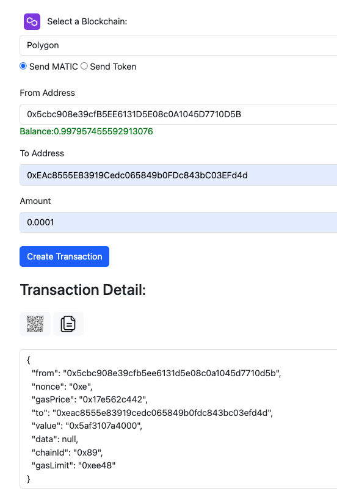
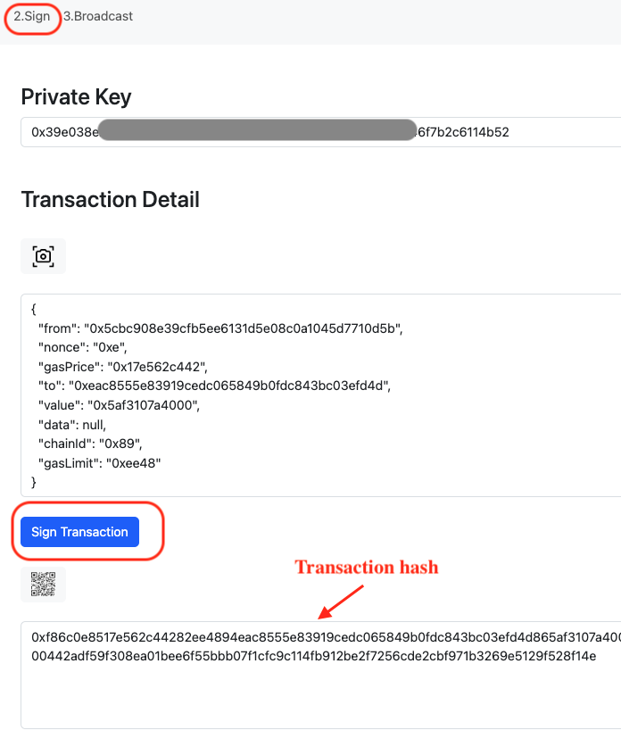
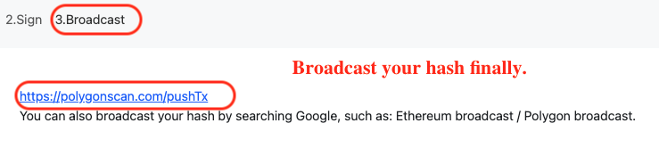

# AirWallet-Ethereum-Offline-Free-Cold-Wallet
Send ETH,BNB,Matic.. or any Token Offline,free,safest,Open Source,support Windows,Mac OS,IOS,android..

``*Free`` 
``*Open source`` 
``*Send ETH,Matic.. Offline`` 
``*Send Token Offline`` 
``*Support most of the paltform`` 
``*Safetest`` 
``*Easily add additional EVMs`` 
``*Use QRcode to transfer data`` 

  
 

 

...
 

Online version:
https://cryptodapprun.github.io/AirWallet-Ethereum-Offline-Free-wallet/

# 1.Create transaction
 

# 2.Sign
 

# 3.Broadcast hash
 
